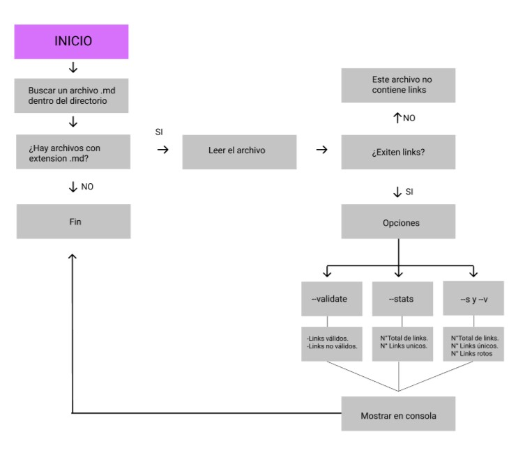
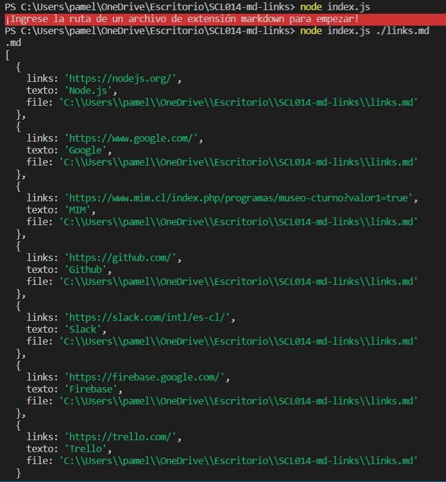
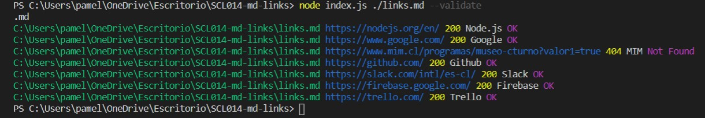
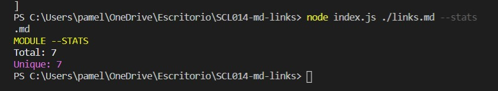
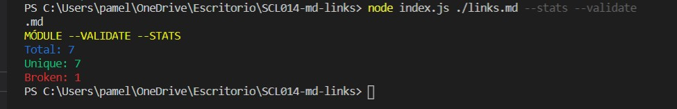
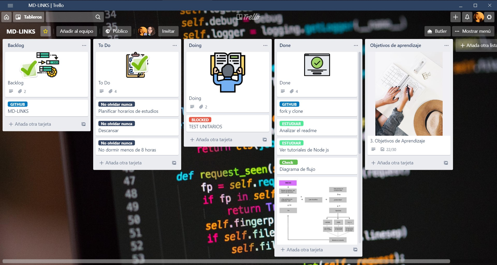

# Md-Links

## 1. Definición del proyecto

### ¿Qué es Markdown?

¿Qué es Markdown?
Creado originalmente por John Gruber, con ayuda de Aaron Swartz en 2004, Markdown es un lenguaje de marcado que facilita la aplicación de formato a un texto plano empleando una serie de caracteres de una forma especial. Con formato nos referimos a itálicas, negritas, listas, encabezados, citas, código en línea o en bloque, vínculos y más.

Markdown es muy utilizado en plataformas como GitHub, foros, blogs como también para crear documentación y es muy común encontrar varios archivos en ese formato en cualquier tipo de repositorio.

Estos archivos Markdown normalmente contienen links (vínculos/ligas) que muchas veces están rotos o ya no son válidos y eso perjudica mucho el valor de la información que se quiere compartir.

Dentro de una comunidad de código abierto, nos han propuesto crear una herramienta usando Node.js, que permite al usuario recorrer un directorio, filtrar los archivos en formato Markdown y extraer los links que contengan para verificar su estado: sin conexión, útiles o rotos y dar algunas estadísticas que se imprimirán en consola como la cantidad de links, el estado de los links y los links únicos.

> Para ver formatos completo [Click aquí](https://markdown.es/sintaxis-markdown/)

2. Diagrama de flujo

## 3. Instrucciones de instalación y uso

> ### 1. Debes tener instalado node.js y npm

> ### 2. Para instalar la librería:

    npm install md-links-pamelabarboza

> ### 3. Uso de la librería:

* **Opción 1:** Muestra los links extraidos del archivo con extensión .md que ingreses

      npx md-links-pamelabarboza tuArchivo.md

* **Opción 2:** Muestra la validación de links del archivo con extensión .md que ingreses

     npx md-links-pamelabarboza tuArchivo.md --validate 

* **Opción 3:** Muestra estadísticas del archivo con extensión .md que ingreses: Links totales | Links únicos

      npx md-links-pamelabarboza tuArchivo.md --stats

* **Opción 4:** Muestra estadísticas más links dañados del archivo con extensión .md que ingreses:  Total |  Unique |  Broken

      npx md-links-pamelabarboza tuArchivo.md --validate --stats || npx md-links-pamelabarboza tuArchivo.md --stats --validate 

***
## 4. Ejemplos de como se ve en consola

>### Opción 1: **npx md-links-pamelabarboza tuArchivo.md**

>### Opción 2: **npx md-links-pamelabarboza tuArchivo.md --validate**

>### Opción 3: **npx md-links-pamelabarboza tuArchivo.md --stats**

>### Opción 4: **npx md-links-pamelabarboza tuArchivo.md --stats --validate || --validate --stats**

## 5. Planificación - Trello

## . Objetivos de aprendizaje

### JavaScript

* [x] Uso de condicionales (if-else | switch | operador ternario)
* [x] Uso de funciones (parámetros | argumentos | valor de retorno)
* [x] Manipular arrays (filter | map | sort | reduce)
* [x] Manipular objects (key | value)
* [ ] Uso ES modules (import | export)
* [x] Uso de callbacks
* [x] Consumo de Promesas
* [x] Creación de Promesas

### Node

* [x] Uso de sistema de archivos. (fs, path)
* [x] Instalar y usar módulos (npm)
* [x] Creación de modules (CommonJS)
* [x] Configuración de package.json
* [x] Configuración de npm-scripts
* [x] Uso de CLI (Command Line Interface - Interfaz de Línea de Comando)

### Testing

* [ ] Testeo unitario
* [ ] Testeo asíncrono
* [ ] Uso de Mocks manuales.

### Estructura del código y guía de estilo

* [x] Organizar y dividir el código en módulos (Modularización)
* [x] Uso de identificadores descriptivos (Nomenclatura | Semántica)
* [x] Uso de linter (ESLINT)

### Git y GitHub

* [x] Uso de comandos de git (add | commit | pull | status | push)
* [x] Manejo de repositorios de GitHub (clone | fork | gh-pages)
* [x] Colaboración en Github (branches | pull requests | |tags)
* [x] Organización en Github (projects | issues | labels | milestones)

### HTTP

* [x] Verbos HTTP (http.get)

### Fundamentos de programación

* [x] Recursión

Autora:
* 👩‍💻 [Pamela Raquel Barboza](https://github.com/PamelaBarboza)
